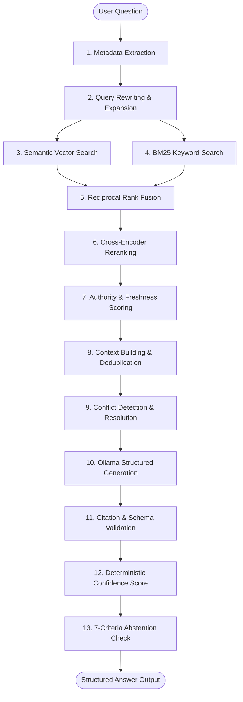

# InsightFlow Support RAG Assistant 🚀

An enterprise-grade, high-precision Retrieval-Augmented Generation (RAG) assistant designed for B2B product support documentation, release notes, known issues, and customer tickets.

Built with **Ollama (`qwen2.5:7b`)**, **ChromaDB**, **SentenceTransformers**, **Rank-BM25**, **Cross-Encoder Reranking**, and **Streamlit**.

---

## 🌟 Key Features & Capabilities

- **Hybrid Multi-Query Retrieval**: Combines dense vector search (ChromaDB + `all-MiniLM-L6-v2`) with sparse keyword search (BM25Okapi) merged via Reciprocal Rank Fusion (RRF).
- **Metadata-Aware Filtering & Fallback**: Automatically extracts product version, category, and error codes to apply strict metadata filters with graceful relaxed fallbacks.
- **Parent-Child & Section Chunking**: Supports parent-child chunking strategies to preserve contextual integrity during answer generation.
- **Authority & Freshness Scoring**: Computes composite chunk scores using normalized relevance, document type authority (`release_notes` > `docs` > `tickets`), and timestamp freshness.
- **Deterministic Confidence & Abstention**: Evaluates 7 strict abstention criteria (e.g., low relevance, no valid citations, outside knowledge base, undocumented future plans, billing/legal policy) before generating answers.
- **Material Conflict Resolution**: Detects opposing claims across documents and resolves conflicts deterministically in favor of official release notes and higher authority scores.
- **17-Stage Pipeline Trace & Latency Breakdown**: Measures exact `time.perf_counter()` timings across all 17 execution phases.
- **SQLite Feedback Storage & Gap Analysis**: Captures user feedback across 7 negative feedback reasons and automatically clusters query gaps via `AgglomerativeClustering` and `KMeans`.
- **Interactive 4-Page Streamlit App**:
  - `Ask Assistant`: Interactive support Q&A chat interface with feedback popover.
  - `Inspect Retrieval`: Real-time candidate rank comparison and 17-stage latency inspector.
  - `Evaluation Dashboard`: Benchmark quality metrics (HitRate, MRR, NDCG, Faithfulness, Abstention/Escalation Accuracy).
  - `Product Insights`: Support analytics, escalation drivers, and automated documentation-gap action plans.

---

## 🏗️ Architecture & Pipeline Flow



---

## 💻 Installation & Requirements

### Prerequisites
1. **Python 3.10+** installed.
2. **Ollama** running locally on port `11434` with `qwen2.5:7b` model:
   ```bash
   ollama pull qwen2.5:7b
   ollama serve
   ```

### Setup
```bash
# Clone the repository
git clone https://github.com/dhurialokb2468/support-rag-assistant.git
cd support-rag-assistant

# Create & activate virtual environment
python -m venv .venv
# On Windows PowerShell:
.\.venv\Scripts\Activate.ps1
# On Linux/macOS:
source .venv/bin/activate

# Install dependencies
pip install -r requirements.txt
```

---

## ⚙️ Configuration (`.env`)

Create a `.env` file in the project root:

```env
OLLAMA_BASE_URL=http://localhost:11434
OLLAMA_MODEL=qwen2.5:7b
EMBEDDING_MODEL=sentence-transformers/all-MiniLM-L6-v2
RERANKER_MODEL=cross-encoder/ms-marco-MiniLM-L-6-v2
CHROMA_PATH=storage/chroma
CHROMA_COLLECTION=support_knowledge
CHUNK_SIZE=800
CHUNK_OVERLAP=120
TOP_K_SEMANTIC=12
TOP_K_KEYWORD=12
TOP_K_RERANK=5
MIN_CONFIDENCE_SCORE=0.45
LOG_LEVEL=INFO
```

---

## 🚀 Running the Application

### 1. Document Ingestion
Ingest knowledge base documents (`data/` directory) into ChromaDB and BM25 store:
```bash
python -m scripts.ingest --reset --strategy parent-child
```

### 2. Launch Streamlit Web App
```bash
python -m streamlit run streamlit_app.py
```
Open `http://localhost:8501` in your browser.

### 3. CLI Q&A Assistant
Run support query with 17-stage latency debug output:
```bash
python -m scripts.ask "Why does CSV export fail after upgrading to version 3.2?" --debug
```

### 4. CLI Retrieval Search Inspector
Inspect hybrid retrieval rankings for a query:
```bash
python -m scripts.search "What does EXP-3204 mean?" --mode full
```

---

## 📊 Evaluation & Experiments

Run evaluation benchmark runners:

```bash
# Run Retrieval Metrics Evaluation (60 test cases)
python -m evaluation.run_retrieval_evaluation

# Run End-to-End Answer Quality & LLM Judge Evaluation
python -m evaluation.run_answer_evaluation

# Run Chunking Strategy Experiment (Fixed 300, 500, 800, 1200, Section-Aware, Parent-Child)
python -m evaluation.run_chunking_experiment
```

---

## 🧪 Running Unit & Integration Tests

Run the test suite across all unit and end-to-end integration tests:

```bash
python -m pytest
```

---

## 📄 License

MIT License. Designed and developed for enterprise product support assistant benchmarking.
